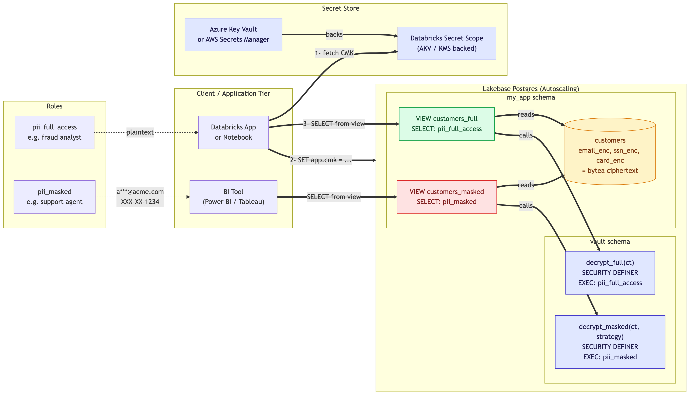
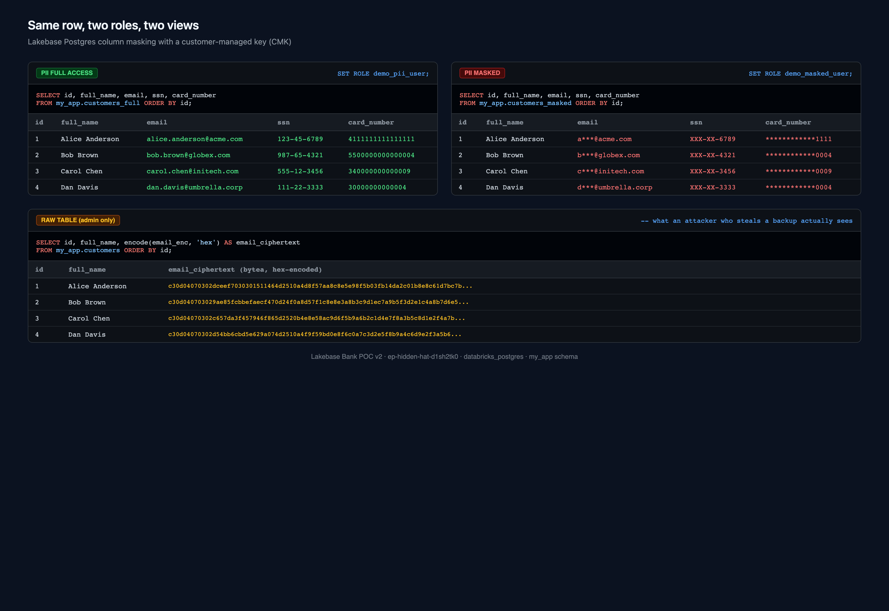
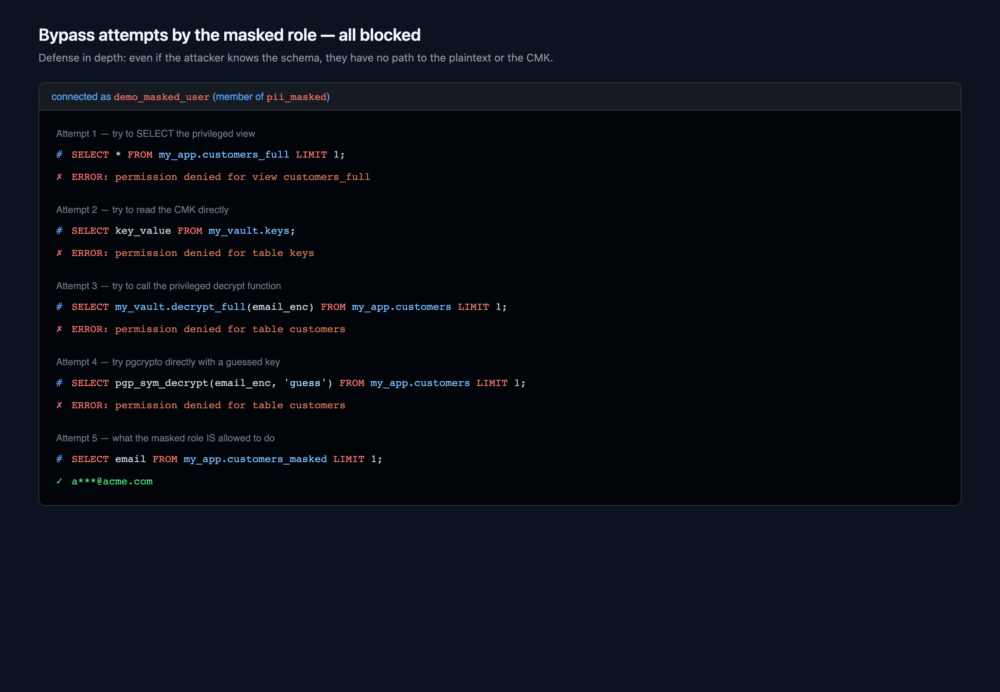
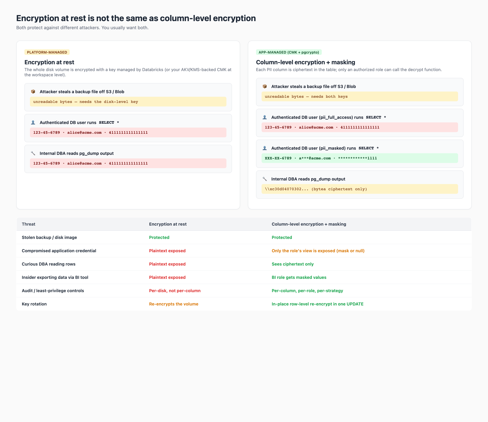

# Lakebase Field-Level Encryption

> Column-level encryption + dynamic masking on **Databricks Lakebase** (managed Postgres) using `pgcrypto` and a **customer-managed key (CMK)** from Azure Key Vault / AWS KMS / GCP KMS.



## What this is

A reference implementation that protects PII in a Lakebase table so that:

- Data on disk and in backups is **bytea ciphertext** — useless to anyone who steals the file.
- A **`pii_full_access`** role sees plaintext via `customers_full`.
- A **`pii_masked`** role sees redacted strings (`a***@acme.com`, `XXX-XX-1234`, `************4242`) via `customers_masked`.
- The **CMK lives in Azure Key Vault** (or any KMS), is fetched per session by the app, and is never persisted in Postgres.
- The plaintext **never crosses a role boundary** inside the database — the masked role's decrypt path never returns the cleartext.

It's the "second layer" on top of platform encryption-at-rest. See [the blog post](blog/lakebase-column-masking-cmk.md) for the full why and the threat-model comparison vs. SQL Server Always Encrypted.

## Same row, two roles, two views



## Repo layout

```
.
├── README.md                              # this file
├── requirements.txt                       # Python deps
├── blog/
│   ├── lakebase-column-masking-cmk.md     # the Medium-ready writeup
│   └── images/                            # architecture + screenshots
├── scripts/
│   └── cmk_column_masking_demo.py         # end-to-end runnable demo
└── sql/
    └── setup.sql                          # paste-into-SQL-editor version
```

## Quick start

### Option A — paste-and-go in the Lakebase SQL Editor

1. Open the Lakebase SQL Editor on your project.
2. Paste [`sql/setup.sql`](sql/setup.sql) and run.
3. Insert a few rows:

   ```sql
   SELECT my_app.add_customer('Alice Anderson', 'alice@acme.com',  '123-45-6789', '4111111111111111');
   SELECT my_app.add_customer('Bob Brown',      'bob@globex.com',  '987-65-4321', '5500000000000004');
   ```

4. See the difference:

   ```sql
   SET ROLE demo_pii_user;
   SELECT * FROM my_app.customers_full;     -- plaintext

   RESET ROLE;
   SET ROLE demo_masked_user;
   SELECT * FROM my_app.customers_masked;   -- a***@acme.com, XXX-XX-6789, ...
   ```

### Option B — automated end-to-end demo from a notebook or CLI

```bash
pip install -r requirements.txt

# Update PROFILE / PROJECT / ENDPOINT in the script for your workspace
DATABRICKS_CONFIG_PROFILE=my-workspace python3 scripts/cmk_column_masking_demo.py
```

The script:

1. Creates the schemas, the encrypted table, the CMK vault, and both roles.
2. Inserts 4 sample customers.
3. Queries the table as `demo_pii_user` (sees plaintext).
4. Queries again as `demo_masked_user` (sees masked).
5. Runs four bypass attempts as the masked role — all are denied.
6. Rotates the CMK in place and re-queries to prove rows were re-encrypted under the new key.

## Bypass attempts — all blocked



## How it differs from encryption-at-rest



| Threat | Encryption at rest | Column-level encryption + masking |
|---|---|---|
| Stolen backup / disk image | Protected | Protected |
| Compromised application credential | Plaintext exposed | Only the role's view (mask or null) |
| Curious DBA reading rows | Plaintext exposed | Sees ciphertext only |
| Insider exporting data via BI tool | Plaintext exposed | BI role gets masked values |
| Audit / least-privilege controls | Per-disk, not per-column | Per-column, per-role, per-strategy |
| Key rotation | Re-encrypts the volume | In-place row-level re-encrypt in one `UPDATE` |

You want **both layers** — they protect different attackers.

## CMK from Azure Key Vault (or AWS KMS / GCP KMS)

The recommended app-side bootstrap:

```python
import psycopg
from databricks.sdk import WorkspaceClient

w = WorkspaceClient(profile="my-workspace")

# 1) Fetch the CMK from Azure Key Vault via Databricks Secret Scope (AKV-backed)
cmk = w.dbutils.secrets.get(scope="lakebase-cmk", key="lakebase-cmk")

# 2) Get a Lakebase OAuth token (1-hour expiry)
ep    = w.postgres.get_endpoint(name="projects/my-project/branches/production/endpoints/primary")
token = w.postgres.generate_database_credential(endpoint=ep.name).token
host  = ep.status.hosts.host

# 3) Connect and inject the CMK as a SESSION-LOCAL GUC (never persisted)
with psycopg.connect(
    host=host, dbname="databricks_postgres",
    user=w.current_user.me().user_name, password=token, sslmode="require",
) as conn, conn.cursor() as cur:
    cur.execute("SELECT set_config('app.cmk', %s, false);", (cmk,))
    cur.execute("SET ROLE demo_pii_user;")
    cur.execute("SELECT id, email, ssn FROM my_app.customers_full;")
    print(cur.fetchall())
```

For BI tools that can't run a Python bootstrap, use a tiny scheduled Databricks Job to push the CMK into a locked-down `vault.keys` table (the variant in `scripts/cmk_column_masking_demo.py`).

## Requirements

- Lakebase Autoscaling project (Postgres 16 or 17). [Supported extensions](https://docs.databricks.com/aws/en/oltp/projects/extensions) — `pgcrypto` is the only one we need.
- Databricks workspace with permissions to create Postgres roles in the project.
- Python 3.10+ for the demo script (`databricks-sdk` ≥ 0.81, `psycopg[binary]` ≥ 3.0).

## Reading order

1. [`blog/lakebase-column-masking-cmk.md`](blog/lakebase-column-masking-cmk.md) — the full writeup with the why, the threat model, and a comparison vs SQL Server Always Encrypted.
2. [`sql/setup.sql`](sql/setup.sql) — the SQL you'd paste into Lakebase SQL Editor.
3. [`scripts/cmk_column_masking_demo.py`](scripts/cmk_column_masking_demo.py) — a runnable, idempotent end-to-end demo with bypass tests.

## License

MIT — see [LICENSE](LICENSE) (or use freely; this is a reference pattern).
